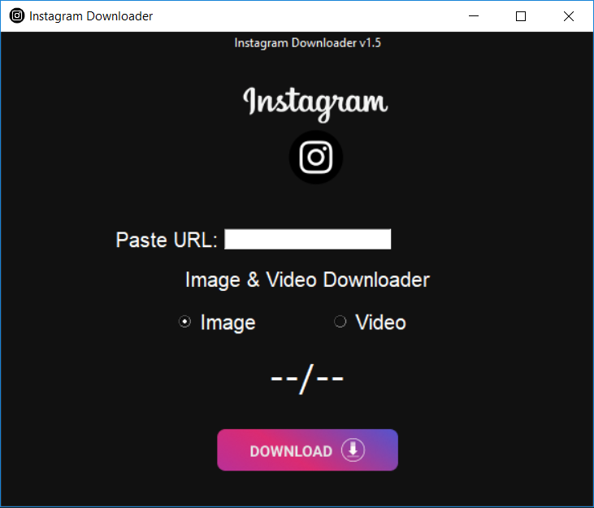

# InstagramDownloadBot
This is Instagram Downloader Tool coded in Python3. Helps to download Instgram Pictures & Videos by Post Link.

### Preview:


## Made For:
- Linux
- Windows
- Mac

## Requirements:
- Python3
- pip3
- Git or Wget
- GUI Support

## Setup & Run:
```
git clone https://github.com/hackelite01/InstagramDownloadBot
cd InstagramDownloadBot
python -m install -r requirements.txt
python InstagramDownloadBot.py
```

### Releases:
[](https://github.com/hackelite01/InstagramDownloadBot/releases)

<details>
  <summary>Important</summary>
  
#### 
  
This is in development. Could be buggy. If you get any kind of error please report in [issues](https://github.com/hackelite01/InstagramDownloadBot/issues). Also you can report on my [Telegram Group](http://t.me/hackelite01). Also this is available on [SourceForge](https://sourceforge.net/projects/InstagramDownloadBot/) as EXE File for Windows.

#### SourceForge:
<a href="https://sourceforge.net/projects/InstagramDownloadBot/"></a>

</details>

#### Telegram Group:
<a href="https://t.me/hackelite01"></a>

## Follow on:
<p align="left">
<a href="https://github.com/hackelite01"></a>
</p>
